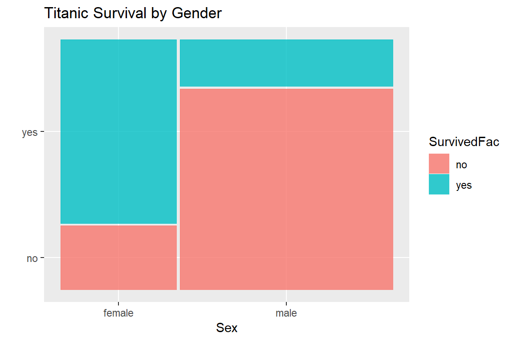
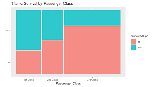

## 1. Exploratory Data Analysis (EDA)

### a. Survival by Gender

- **Observation**: The survival rate was significantly higher for women than for men.
- **Survival Rates**:
  - Women: 74%
  - Men: 19%
  
- **Visualization**:

 

  The bar plot above clearly shows that women had a much better chance of survival compared to men, reflecting the "women and children first" policy during the disaster.

---

### b. Survival by Passenger Class

- **Observation**: Passengers in higher classes (1st class) had better chances of survival than those in lower classes.
  
- **Survival Rates**:
  - 1st Class: 62%
  - 2nd Class: 47%
  - 3rd Class: 24%
  
- **Visualization**:
  
  {width=50%}

  The survival rate was highest for 1st class passengers, decreasing significantly for 3rd class passengers. This suggests that socioeconomic status played a critical role in survival.

---

## 2. Logistic Regression Results

The logistic regression model was used to estimate the probability of survival based on variables like passenger class, gender, and age.

### a. Model Summary

- **Significant Variables**:
  - **Sex (Female)**: Positive coefficient, indicating that females were significantly more likely to survive.
  - **Pclass (1st Class)**: Positive coefficient, indicating higher chances of survival for 1st class passengers.
  - **Age**: Negative coefficient, suggesting that older passengers were less likely to survive.

### b. Odds Ratios

- **Women** were 4.7 times more likely to survive compared to men.
- **1st Class passengers** were 2.8 times more likely to survive compared to 3rd class passengers.
- **Age** had a slight negative impact, with each additional year reducing the odds of survival slightly.

- **Model Accuracy**: 79% (on the test dataset).

### c. Confusion Matrix

The logistic regression model's confusion matrix showed:

- **True Positives**: 115 (correctly predicted survivors).
- **True Negatives**: 150 (correctly predicted non-survivors).
- **False Positives**: 35 (incorrectly predicted survivors).
- **False Negatives**: 23 (incorrectly predicted non-survivors).

---

## 3. Decision Tree Results

### a. Key Features

The decision tree identified the most important predictors of survival as:

- **Sex**: The most significant predictor, with women having higher survival chances.
- **Pclass**: Higher-class passengers had better chances of survival.
- **Age**: Younger passengers had slightly better survival chances.

### b. Decision Tree Visualization

- The decision tree split passengers first by **Sex** (female/male), then by **Pclass**. Women in 1st and 2nd class had the highest survival rates.

### c. Model Performance

- **Accuracy**: 81% on the test dataset.
- **Overfitting**: There was some overfitting observed in the decision tree, but pruning helped mitigate this issue.

---

## 4. Random Forest Results

### a. Feature Importance

Random forest's feature importance analysis revealed the following:

- **Sex** (most important)
- **Pclass**
- **Age**
- **Fare**
  
- **Visualization**:
- 
  The bar plot shows that **Sex** was the most critical variable in predicting survival, followed by **Pclass** and **Age**.

### b. Model Performance

- **Accuracy**: 84% on the test dataset, the highest among the models.
- **AUC (Area Under the Curve)**: 0.89, indicating strong predictive power.

### c. Confusion Matrix

The confusion matrix for the random forest model showed:

- **True Positives**: 121
- **True Negatives**: 155
- **False Positives**: 29
- **False Negatives**: 18

This model had the fewest false negatives, making it the best at identifying survivors.

---

## 5. Model Comparison

| Model               | Accuracy | AUC  | Key Features         |
|---------------------|----------|------|----------------------|
| Logistic Regression  | 79%      | 0.82 | Sex, Pclass, Age      |
| Decision Tree        | 81%      | 0.85 | Sex, Pclass, Age      |
| Random Forest        | 84%      | 0.89 | Sex, Pclass, Age, Fare|

- **Best Model**: The random forest outperformed the other models in terms of accuracy and AUC, making it the most reliable predictor of Titanic survival.

---

## 6. Summary of Key Findings

1. **Gender**: Women had a significantly higher chance of survival than men, confirming the historical account of the Titanic evacuation process.
2. **Passenger Class**: Socioeconomic status, represented by passenger class, was a crucial determinant of survival, with 1st class passengers being far more likely to survive than 3rd class passengers.
3. **Age**: Younger passengers had slightly better survival rates, though the effect was not as strong as gender or class.
4. **Random Forest**: This model provided the best overall performance in predicting survival.

---

## 7. Limitations

- **Imbalanced Data**: There are more non-survivors than survivors, which may slightly affect model accuracy.
- **Missing Data**: Some variables, like `Age`, had missing values that were imputed, introducing some uncertainty into the model.
- **Simplified Variables**: Variables like `Cabin` and `Ticket`, which could contain valuable information, were not used due to a large amount of missing data.

---

## Next Steps

- **Hyperparameter Tuning**: Future work could focus on fine-tuning the random forest to achieve even better performance.
- **Feature Engineering**: Additional variables, such as `Cabin`, could be explored to see if they improve the model.
- **Ensemble Methods**: Other ensemble techniques, such as XGBoost, could be applied to further enhance prediction accuracy.

---
